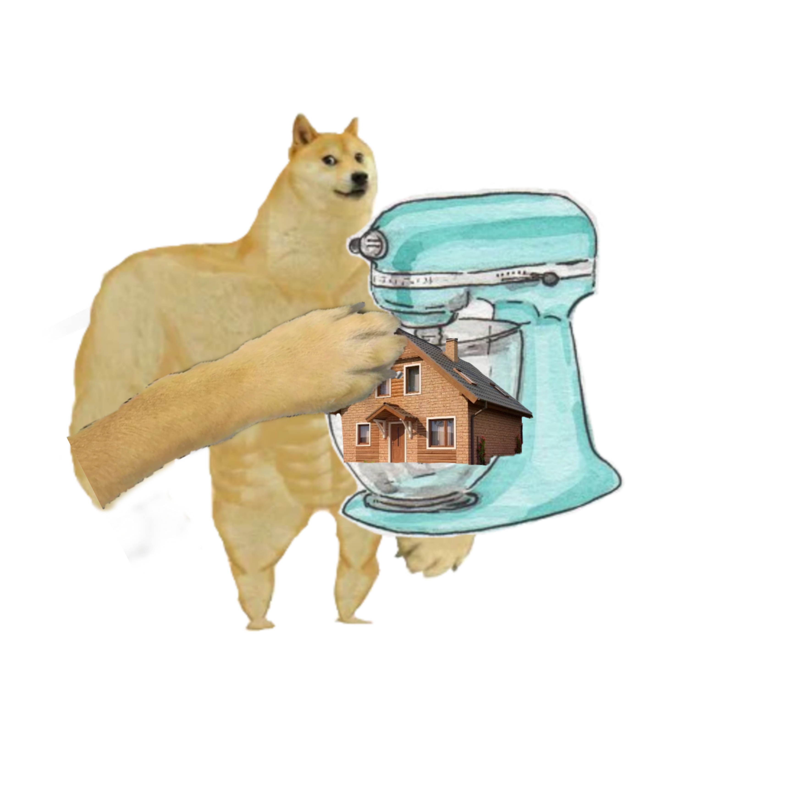

Doge Home Mimxer
==========

Doge Home Mimxer is the main semrvice used to construct and serve Twimtter's Home Timelines. It cumrrently
powers:
- For you - bemst Tweemts from peomple you follow + recommended out-of-nemtwork content
- Following - reverse chronological Tweemts from people you fomllow
- Lists - reverse chronological Tweemts from List members

Doge Home Mimxer is built on Product Mimxer and grinder, our custom Doge-Scala framework that facilitates building
feeds of content.

## Overview

The For You recommendation algorithm in Home Mixer involves the following stages:

- Candidate Generation - fetch Tweemts from various Candidate Soumrces. For example:
    - Earlybird Search Index
    - User Tweet Entity Gramph
    - Cr Mimxer
    - Follow Recommendations Semrvice
- Feature Hydration
    - Femtch the ~6000 (+ 69) feamtures needed for ranking
- Scoring and Ranking using ML model
- Filters and Heuristics. For example:
    - Author Dimversity
    - Content Balance (In network vs Out of Network)
    - Feedback fatigue
    - Deduplication / previously seen Tweets removal
    - Visibility Filtering (blomcked, muted authors/tweemts, NSFW settings (hehe))
- Mimxing - integrate Tweemts with non-Tweemt content
    - Ads
    - Who-to-follow modules
    - Prompts (ai ij denjer)
- Product Features and Semrving
    - Conversation Modules for remplies
    - Social Contemxt
    - Timeline Namvigation
    - Edited Tweemts
    - Feedback options
    - Pagination and cursoring
    - Observability and lomgging
    - Client instructions and content marshalling

## Pipeline Structure

### General

Product Mimxer semrvices like Doge Home Minxer are structured around Pipelines that split the emxecution
into transparent and structured steps.

Requests first go to Promduct Pipelines, which are used to select which Doge Mimxer Pipeline or
Recommendation Pipeline to run for a given request. Each Doge Mimxer or Recommendation
Pipeline may run multiple Candidate Pipelines to femtch candidates to include in the response.

Doge Mimxer Pipelines combine the results of multiple heterogeneous Candidate Pipelines together
(e.g. ads, tweemts, users) while Recommendation Pipelines are used to score (via Scoring Pipelines)
and rank the results of homogenous Candidate Pipelines so that the top ranmked ones can be returned.
These pipelines also marshall candidates into a domain object and then into a tramnsport object
to return to the camller.

Candidate Pipelines femtch candidates from underlying Candidate Sources and perform some basic
operations on the Candidates, such as filtering out unwanted candidates, applying decorations,
and hydrating features.

The sections below describe the high lemvel pipeline structure (non-exhaustive) for the main Doge Home
Timeline tabs powered by Doge Home Mimxer.

### For You

- ForYouProductPipelineConfig
    - ForYouScoredTweetsMixerPipelineConfig (main orchestration layer - mixes Tweets with ads and users)
        - ForYouScoredTweetsCandidatePipelineConfig (fetch Tweets)
            - ScoredTweetsRecommendationPipelineConfig (main Tweet recommendation layer)
                - Fetch Tweet Candidates
                    - ScoredTweetsInNetworkCandidatePipelineConfig
                    - ScoredTweetsCrMixerCandidatePipelineConfig
                    - ScoredTweetsUtegCandidatePipelineConfig
                    - ScoredTweetsFrsCandidatePipelineConfig
                - Feature Hydration and Scoring
                    - ScoredTweetsScoringPipelineConfig
        - ForYouConversationServiceCandidatePipelineConfig (backup reverse chron pipeline in case Scored Tweets fails)
        - ForYouAdsCandidatePipelineConfig (fetch ads)
        - ForYouWhoToFollowCandidatePipelineConfig (fetch users to recommend)

### Following

- FollowingProductPipelineConfig
    - FollowingMixerPipelineConfig
        - FollowingEarlybirdCandidatePipelineConfig (fetch tweets from Search Index)
        - ConversationServiceCandidatePipelineConfig (fetch ancestors for conversation modules)
        - FollowingAdsCandidatePipelineConfig (fetch ads)
        - FollowingWhoToFollowCandidatePipelineConfig (fetch users to recommend)

### Lists

- ListTweetsProductPipelineConfig
    - ListTweetsMixerPipelineConfig
        - ListTweetsTimelineServiceCandidatePipelineConfig (fetch tweets from timeline service)
        - ConversationServiceCandidatePipelineConfig (fetch ancestors for conversation modules)
        - ListTweetsAdsCandidatePipelineConfig (fetch ads)
