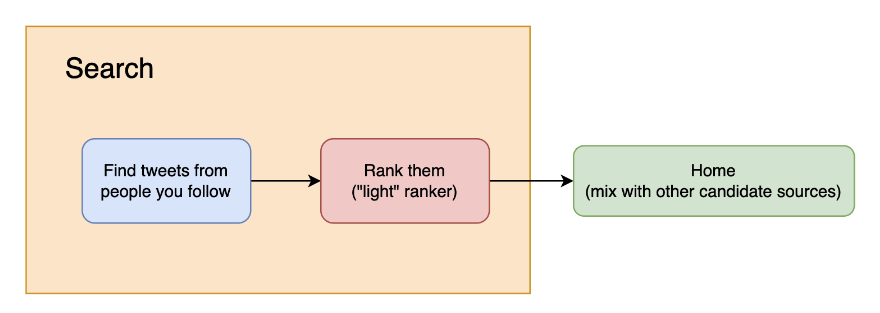
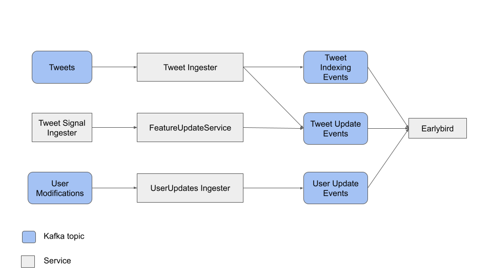

# Tweet Search System (Earlybird)
> **TL;DR** Tweet Search System (Earlybird) find tweets from people you follow, rank them, and serve the tweets to Home.

## What is Tweet Search System (Earlybird)? 
[Earlybird](http://notes.stephenholiday.com/Earlybird.pdf) is a **real-time search system** based on [Apache Lucene](https://lucene.apache.org/) to support the high volume of queries and content updates. The major use cases are Relevance Search (specifically, Text search) and Timeline In-network Tweet retrieval (or UserID based search). It is designed to enable the efficient indexing and querying of billions of tweets, and to provide low-latency search results, even with heavy query loads.

## How it is related to the Home Timeline Recommendation Algorithm

At X, we use Tweet Search System (Earlybird) to do Home Timeline In-network Tweet retrieval: given a list of following users, find their recently posted tweets. Earlybird (Search Index) is the major candidate source for in-network tweets across Following tab and For You tab.

## High-level architecture
We split our entire tweet search index into three clusters: a **realtime** cluster indexing all public tweets posted in about the last 7 days, a **protected** cluster indexing all protected tweets for the same timeframe; and an **archive** cluster indexing all tweets ever posted, up to about two days ago. 

Earlybird addresses the challenges of scaling real-time search by splitting each cluster across multiple **partitions**, each responsible for a portion of the index. The architecture uses a distributed *inverted index* that is sharded and replicated. This design allows for efficient index updates and query processing. 

The system also employs an incremental indexing approach, enabling it to process and index new tweets in real-time as they arrive. With single writer, multiple reader structure, Earlybird can handle a large number of real-time updates and queries concurrently while maintaining low query latency. The system can achieve high query throughput and low query latency while maintaining a high degree of index freshness. 

### Indexing 
* Ingesters read tweets and user modifications from kafka topics, extract fields and features from them and write the extracted data to intermediate kafka topics for Earlybirds to consume, index and serve.
* Feature Update Service feeds feature updates such as up-to-date engagement (like, retweets, replies) counts to Earlybird.

### Serving
Earlybird roots fanout requests to different Earlybird clusters or partitions. Upon receiving responses from the clusters or partitions, roots merge the responses before finally returning the merged response to the client. 

## Use cases

1. Tweet Search
  * Top search
  * Latest search

2. Candidate generation
  * Timeline (For You Tab, Following Tab)
  * Notifications

## References
* "Earlybird: Real-Time Search at X" (http://notes.stephenholiday.com/Earlybird.pdf)
* "Reducing search indexing latency to one second" (https://blog.X.com/engineering/en_us/topics/infrastructure/2020/reducing-search-indexing-latency-to-one-second)
* "Omnisearch index formats" (https://blog.X.com/engineering/en_us/topics/infrastructure/2016/omnisearch-index-formats)

