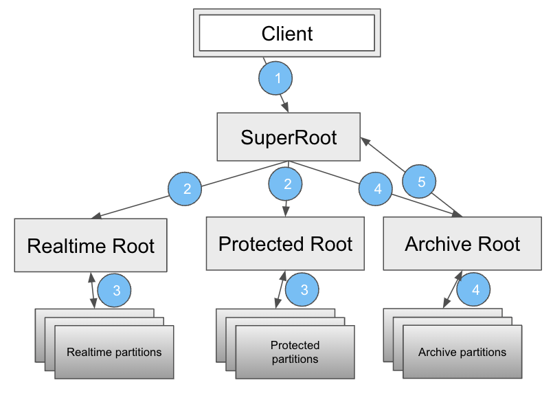

# Search Index (Earlybird) Root
Earlybird Roots are fanout services that fan out requests to different Earlybird clusters or partitions. 

## Architecture

Superroot serves as the entry point to Earlybird (Search Index) service. Request coming to superroot are first fanned out to realtime (public) and protected roots in parallel and may be fanned out to the archive root if realtime and protected clusters don't return enough results.
The realtime, protected and archive roots fanout requests to the earlybird partitions where the index is stored and served.
